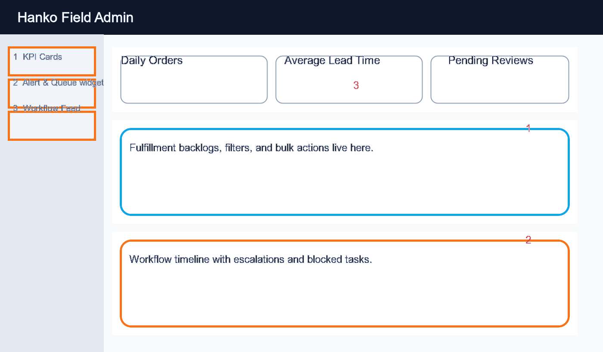
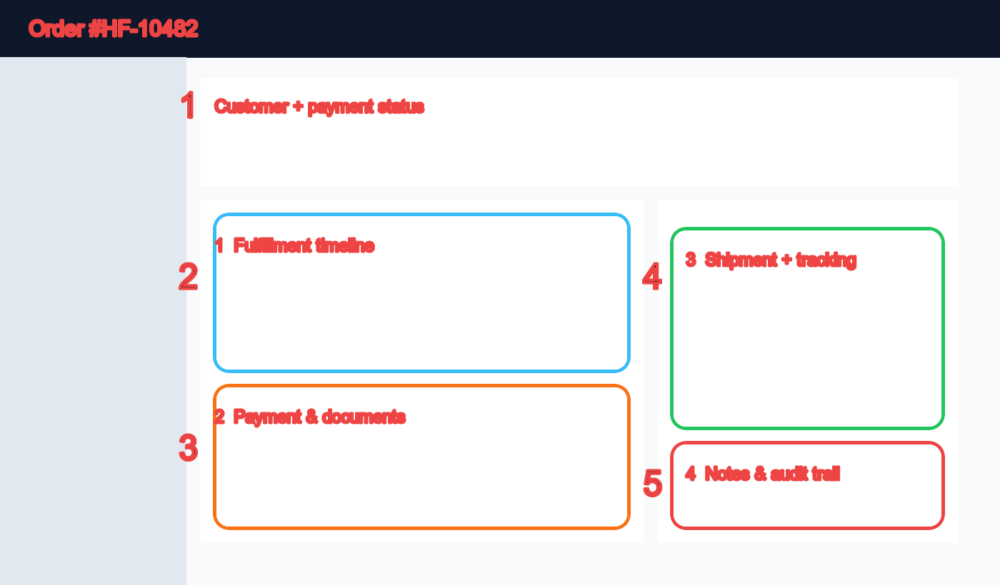
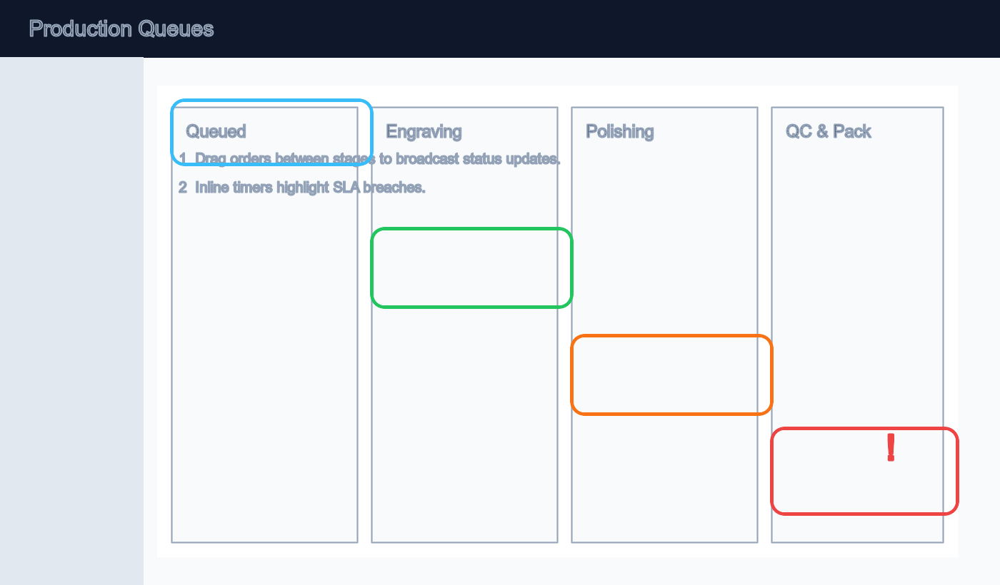
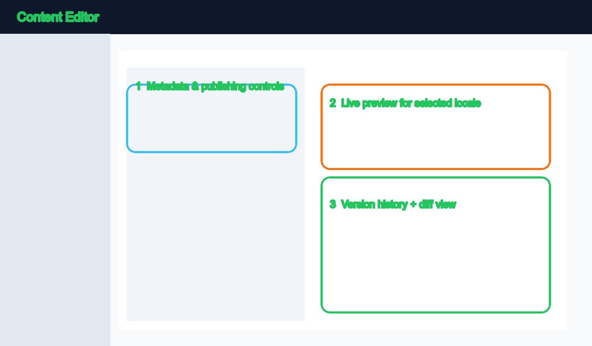

# Hanko Field 管理画面スタッフガイド

> 最終更新: 2025-11-08 / オーナー: Admin Enablement Team
>
> 補足リソース: `doc/admin/admin_design.md`, `doc/admin/navigation_rbac.md`, `doc/admin/data_contract_checklist.md`

このガイドはオペレーション、CS、マーケティングが毎日の業務を安全に遂行できるように、主要モジュールの目的・操作手順・トラブル対処をまとめたものです。すべてのスクリーンショットは `doc/admin/assets/` に保存され、開発ブランチの状態を反映します。

## 1. アクセス要件とセットアップ

### 1.1 ロールと権限

| ロール | 主な権限 | 備考 |
| --- | --- | --- |
| `OpsManager` | 受注/出荷/制作、在庫リリース、返金承認 | 出荷ラベルと支払確定を実行できる唯一のロール |
| `CSLead` | 顧客検索、注文閲覧、返品/再送リクエスト作成 | 返金確定は OpsManager にエスカレーション |
| `Marketing` | コンテンツ(CMS)、カタログ、クーポン管理 | RBAC により注文データはサマリのみ閲覧可 |
| `CapStaffManage` | スタッフ招待、ロール管理、システム設定 | Firebase Auth + Admin RBAC の組み合わせ |

### 1.2 サインイン手順

1. `https://admin.hanko-field.jp/login` にアクセスし、会社メールで Firebase Auth にログイン。
2. 2FA コード（Authenticator / SMS）を入力。5回失敗で 15 分ロックアウト。
3. 初回ログイン時は `/admin/profile` で API キーを作成し、端末を信頼済みに登録。
4. 環境バッジ（右上 `STG` / `PRD`）を確認してから業務を開始。

### 1.3 推奨ブラウザ & デバイス
- Google Chrome 最新版（Tailwind + htmx の最新機能が必要）。
- 1440px 以上の解像度を推奨。Field iPad からアクセスする場合はサイドバーを折りたたんで利用。

## 2. UI ツアー

### 2.1 レイアウトコールアウト

1. **KPI カード**: 昨日比、SLA 逸脱数、在庫警告を確認。クリックで `/admin/fragments/kpi` を即時更新。
2. **アラート & キュー**: 失敗ジョブ/要調査注文が並ぶ。右上の `Acknowledge` で自分にアサイン。
3. **ワークフローフィード**: htmx によりフィルタ適用が即時反映。`Shift + /` で検索ダイアログを開く。

### 2.2 共通操作
- **検索**: `/admin/search` は注文・顧客・レビューを横断検索。`status:pending customer:tanaka` のようなクエリに対応。
- **フィルタフォーム**: 送信先は `.../table` フラグメント。`Enter` で submit、`Esc` でリセット。
- **モーダル**: すべて `#modal` ターゲット。`Ctrl + Enter` で主要ボタンを実行。
- **トースト**: htmx レスポンスヘッダー `HX-Trigger: toast` で成功/失敗が表示される。

## 3. コアワークフロー

### 3.1 モーニングチェック（OPS）
1. `/admin` で KPI を確認し、`Pending Shipments` が SLA（24h）を超えていないかをチェック。
2. `Alerts` セクションで `Job failures` と `Inventory below threshold` を確認。影響度を `Major/Minor` でタグ付け。
3. `Workflow Feed` から該当注文を開き、担当者を自分に変更（`Assign to me`）。
4. 10:00 までに `#ops-daily` Slack へスクリーンショットを共有。

### 3.2 注文ライフサイクル（OPS + CS）

**A. 受付〜支払確定**
1. `/admin/orders` のフィルタで `status=paid&hasRefund=false` を適用。
2. 一括チェックボックスで 10 件ずつ `Bulk → Create shipment labels` を実行。
3. 住所不備がある場合は `Edit Recipient` モーダルで修正し、メモを残す。

**B. 注文詳細での対応**
1. **(1) 概要パネル**: 顧客連絡先と支払状況。赤バッジなら `Retry capture` を押す前に PSP に確認。
2. **(2) タイムライン**: `Production events` を確認。遅延が 2 ステップ続いたら制作チームにエスカレート。
3. **(3) 支払い/書類**: `Issue invoice` で PDF を生成し、メールテンプレに添付。
4. **(4) 追跡情報**: `Resend tracking` で顧客に再送可能。
5. **(5) 監査ログ**: 編集履歴はすべて `/admin/audit-logs` に同期。CS はここから顧客への説明根拠を取得。

**C. 返品・返金**
1. 注文詳細右上 `Refund` をクリックし、理由コードと金額を入力。
2. OpsManager が 2FA を再入力すると `POST /orders/{id}/payments:refund` が実行される。
3. `Status → Closed` に更新し、`Reason` を選択。監査ログに自動記録される。

### 3.3 出荷・追跡モニタ
- `/admin/shipments/tracking` で遅延フラグを確認。`carrier=yamato` などでフィルタ。
- 追跡番号をクリックするとキャリアサイトに遷移。`Escalate` で CS にタスクを発行。
- バッチ印刷の場合は `/admin/shipments/batches` で `Generate labels` → ダウンロード。

### 3.4 制作カンバン（工房）

1. 左サイドから `Production > Queues` を開くと、各列（Queued → Engraving → Polishing → QC & Pack）が表示。
2. オーダーカードをドラッグすると `POST /admin/orders/{id}/production-events` が送信され、ダッシュボードに反映。
3. SLA 逸脱カードは赤枠で表示。`Hold reason` を入力してから次工程へ進める。
4. QC タブから不合格を登録すると CS へ自動通知される。

### 3.5 カタログ & CMS（マーケティング）

**テンプレ・素材の更新**
1. `/admin/catalog/templates` を開き、`New` でテンプレを作成。
2. 必須フィールドを入力後、`Preview` でレンダリングを確認。
3. `Save & Publish` で `PUT /admin/catalog/templates/{id}` が実行され、即時反映。

**ガイド / 固定ページ**
1. `Content > Guides` で対象を選択。
2. 左ペインでメタデータ・公開範囲を設定（Callout 1）。
3. 右ペインでライブプレビューを確認（Callout 2）。`ja/en` のタブで多言語切替。
4. バージョン履歴から差分比較（Callout 3）。必要なら `Rollback`。

**プロモーション**
1. `/admin/promotions` でクーポンを一覧。`+ New coupon` から閾値・割引種別を選択。
2. `Usage` タブで顧客ごとの利用状況を CSV で出力。
3. キャンペーン終了時は `Archive` し、`/admin/system/tasks` でキャッシュクリアを実行。

### 3.6 顧客対応 & コンプライアンス
- `/admin/customers` で検索し、`Deactivate & Mask` で退会処理（CSLead 以上）。
- `/admin/reviews?moderation=pending` でレビュー承認/却下。テンプレ返信は `Saved replies` から選択。
- `/admin/org/staff` は CapStaffManage のみアクセス可。ロール変更後はユーザー再ログインが必要。

## 4. トラブルシューティング

| 症状 | 原因 | 対処 |
| --- | --- | --- |
| サインイン後に真っ白 | ブラウザキャッシュに古い htmx | `Cmd + Shift + R` で強制リロード。改善しなければ `localStorage.clear()`。
| モーダル内のボタンが無効 | CSRF トークンの期限切れ | モーダルを閉じてページを再表示。繰り返す場合は `/admin/logout` → 再ログイン。
| 返金 API が 409 を返却 | 支払が既に返金済み | PSP ダッシュボードでステータス確認 → `Mark as refunded` を実行して監査ログを残す。
| htmx リクエストが 401 | Firebase ID トークン失効 | `/admin/login?redirect=` 付きで再ログイン。フロントは自動でリトライしないため手動更新が必要。
| 画像アップロードが失敗 | Storage への権限不足 | `CapStaffManage` に依頼してロールを `OpsManager` へ昇格後、再試行。

追加で問題が発生した場合は `#admin-help` Slack で `timestamp + URL + console log` を添えて報告してください。

## 5. ベストプラクティス & ショートカット
- `Shift + K` : `/admin/search` を開く。
- `G` → `D` : ダッシュボードへ。`G` → `O` で注文一覧。
- `?` : 「ヘルプとショートカット」モーダルを表示。
- E2E 更新前後は `Cmd + E` で htmx エラーオーバーレイを開き、レスポンスを確認。

## 6. 付録: クイックリンク

| ページ | パス | 主担当 |
| --- | --- | --- |
| ダッシュボード | `/admin` | OpsManager |
| 注文一覧 | `/admin/orders` | Ops / CS |
| 出荷追跡 | `/admin/shipments/tracking` | Ops |
| 制作キュー | `/admin/production/queues` | 工房リーダー |
| カタログ（テンプレ） | `/admin/catalog/templates` | Marketing |
| ガイド管理 | `/admin/content/guides` | Marketing |
| プロモーション | `/admin/promotions` | Marketing |
| 顧客一覧 | `/admin/customers` | CS |
| 監査ログ | `/admin/audit-logs` | CapStaffManage |

---

このガイドは随時更新されます。フィードバックやスクリーンショットの差し替え依頼は GitHub Issue `admin-docs` ラベルで登録してください。
